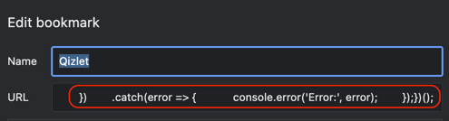

## Quizlet data parser Bookmarklet

1. Copy text from [./dist.txt](dist.txt) file
2. Create new bookmark and paste the text as an URL:
>   
3. Go to Quizlet card and click on the bookmark, and you will get the text in your clipboard and browser console
4. Go to https://www.omnisets.com/ and follow the instruction: https://www.omnisets.com/tutorials/1/

https://github.com/viktor-silakov/quizlet-parser/assets/23633060/60e9ea6f-f844-4487-a2f4-fd21f870bbb6

